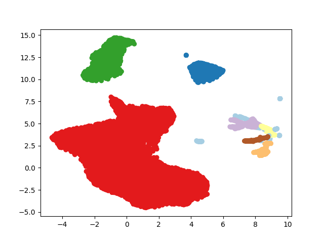

# carimam

## spectral_extraction.py
python script to extract spectrograms out of wav files. 
Several configurations are given (sampling rate, winsize...) for sevral frequency bands time resolutions of interest

## sort_cluster.py
python script to cluster spectral features
plots the scatter UMAP projection, and the found clusters
DBSCAN parameters need to be tuned specifically

